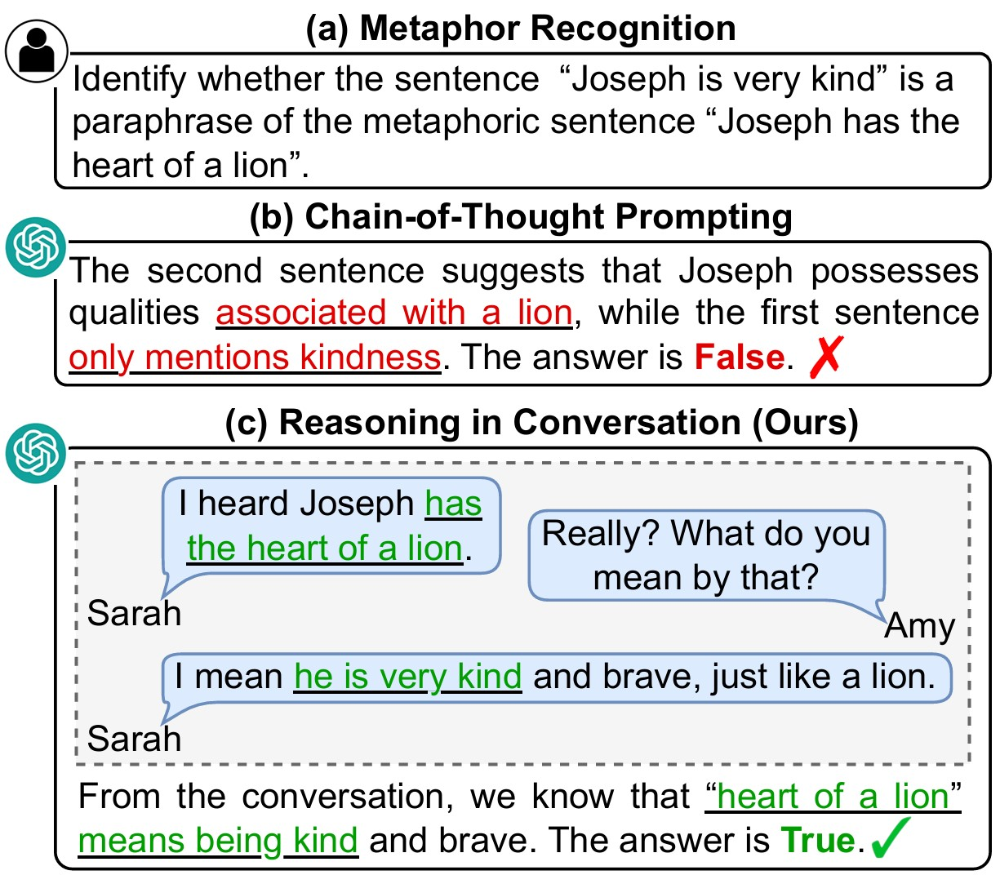
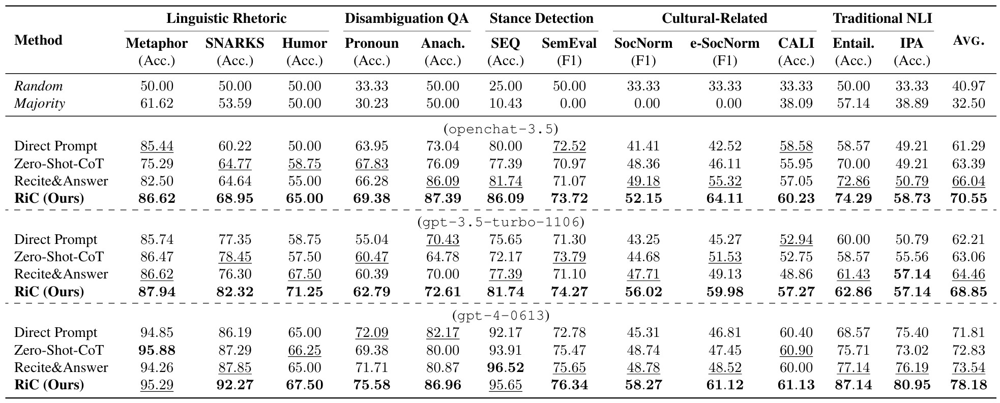
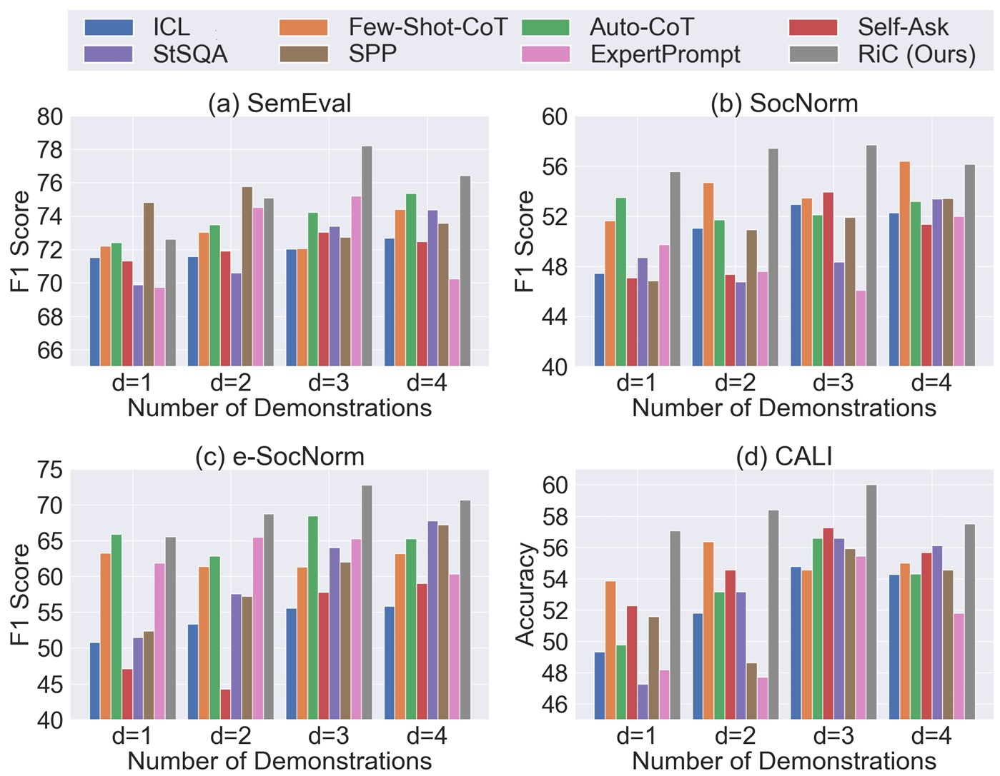

# Reasoning in Conversation: Solving Subjective Tasks through Dialogue Simulation for Large Language Models

**❗❗REPO UNDER CONSTRUCTION❗❗**

[**📖 arXiv**](https://arxiv.org/abs/2402.17226)

This repo contains the code for paper [Reasoning in Conversation: Solving Subjective Tasks through Dialogue Simulation for Large Language Models](https://arxiv.org/abs/2402.17226).

## Introduction

Compared to objective tasks, subjective tasks focus more on interpretation or emotional response rather than a universally accepted reasoning pathway. Based on the characteristics of the tasks and the strong dialogue-generation capabilities of LLMs, we propose RiC (Reasoning in Conversation), a method that focuses on solving subjective tasks through dialogue simulation.

The motivation of RiC is to mine useful contextual information by simulating dialogues instead of supplying CoT style rationales, thereby offering potential useful knowledge behind dialogues for giving the final answers. We evaluate both API-based and open-source LLMs including GPT-4, ChatGPT, and OpenChat across twelve tasks. Experimental results show that RiC can yield significant improvement compared with various baselines.



## Experiments

Main results in zero-shot setup.



Performance of baselines and our RiC method by using different numbers of demonstrations.



## Installation

*Comming Soon!*

## Run RiC

*Comming Soon!*

## Citation

```bibtex
@article{wang2024reasoning,
  title={Reasoning in Conversation: Solving Subjective Tasks through Dialogue Simulation for Large Language Models},
  author={Wang, Xiaolong and Wang, Yile and Zhang, Yuanchi and Luo, Fuwen and Li, Peng and Sun, Maosong and Liu, Yang},
  journal={arXiv preprint arXiv:2402.17226},
  year={2024}
}
```